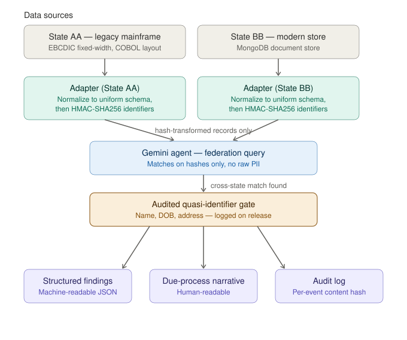

# UI Fraud Coordination Agent

A Gemini-powered agent that detects multi-state unemployment insurance fraud by reading legacy mainframe and modern data sources through a privacy-preserving adapter pattern.

## What this is

Two simulated state unemployment systems with heterogeneous data formats — one representing a legacy mainframe (EBCDIC fixed-width records, COBOL copybook layout) and one representing a modernized state (MongoDB document store) — coordinated by a Gemini agent built on Google Cloud Agent Platform. The agent reads each source through a format-specific adapter, transforms personally identifiable information using HMAC-SHA256 under a federation-wide salt, and surfaces multi-state fraud patterns without raw PII ever crossing state boundaries.

Built for the [Google Cloud Rapid Agent Hackathon](https://rapid-agent.devpost.com/) — MongoDB, Arize and Dynatrace Track.

## Problem

The U.S. Department of Labor Office of Inspector General has documented at least $28.9 billion in pandemic-era unemployment insurance fraud. One finding identified 991,793 Social Security Numbers filed across multiple states simultaneously — a pattern detectable only by cross-state correlation that current state UI system architectures make practically impossible.

Two structural barriers prevent coordinated detection:

1. **Regulatory:** 20 CFR 603 governs disclosure of UI claim information and imposes strict confidentiality requirements. States cannot freely share raw claimant data.
2. **Technical:** GAO-23-105478 found that the majority of state UI systems run on legacy mainframe infrastructure, much of it 40-50 years old.

This project demonstrates that both barriers can be addressed simultaneously: an adapter pattern absorbs the heterogeneity, and a transformed-identifier protocol satisfies confidentiality requirements.

## Architecture

A single Gemini agent (built on Google Cloud Agent Platform) orchestrates tools that:

- Read each state's native data format (legacy EBCDIC or modern JSON)
- Transform sensitive identifiers under a federation-wide cryptographic salt
- Query the federation for cross-state matches
- Produce due-process explanations for any flagged finding
- Log every cross-state query to an audit trail with per-event content hashes.

Partner integrations:

- **MongoDB Atlas** — modernized state data + agent working graph + audit collection
- **Arize AX** — agent reasoning observability and behavior evaluation
- **Dynatrace** — distributed tracing across the federation flow



## Worked example

A single investigation, end to end. An investigator submits one claim ID.
The agent reads the claim from its source state, computes federation-safe
hashes for its sticky identifiers, queries the federation, and returns two
artifacts: a machine-readable findings object and a due-process narrative.

Access to data is two-tiered by design. Transformed identifier hashes are
exchanged freely across the federation. Quasi-identifiers (name, date of
birth, address) are never exchanged in the federation query — they are
retrieved only after a cross-state match is found, through a separate
audited tool that logs every release with a justification and a content
hash. The narrative below shows those post-audit retrievals; the audit
references at the bottom are the log entries that authorized them.

### Input

claim_id: SA-000001126

### Output 1 — structured findings (machine-readable)

```json
{
  "source_claim_id": "SA-000001126",
  "primary_outcome": "cross_state",
  "cross_state_matches": {
    "claimant_ssn_hash": ["SB-000000692"],
    "device_fingerprint_hash": [],
    "bank_routing_hash": [],
    "bank_account_hash": []
  },
  "within_state_matches": {
    "claimant_ssn_hash": [],
    "device_fingerprint_hash": [],
    "bank_routing_hash": [],
    "bank_account_hash": []
  },
  "audit_event_hashes": [
    "7b69f343f572e4b64dbee16bcde0d96a643fd982c3dd5e83ab552667456e9b99",
    "7fc720e4a6e695d7ca397bb34f96114b24eb18ebb6e50ec0d9e1bb56d8c024c7",
    "92a5596e685d9ef4c11c467101d10fe9633912ee6097461356bad935e926f8c3",
    "3782c554d664fc2e917ed8a612c32ce248df2c13a7c2df6612d887749d192a35",
    "fa410aed2fbd8b35f49900bb66389535812173d1dae95880a0c0d2fc145e11c6",
    "908f5322e3ba916f2b39168d1385ce1fabc07b96e5b9c259df9386a5b6019656"
  ]
}
```

The match is on `claimant_ssn_hash` only. The two claims share a
transformed SSN identifier but nothing else — no shared device, bank
routing, or bank account. That single-axis match is the signal.

### Output 2 — due-process narrative (human-readable)

> **Claim under investigation:** SA-000001126
>
> **Primary finding — cross-state matches: yes, 1**
>
> - SSN hash: SB-000000692
> - Device fingerprint hash: none
> - Bank routing hash: none
> - Bank account hash: none
>
> **Secondary finding — within-state collisions: no, 0**
>
> **Retrieved claimant context (cross-state matches only, with audit trail):**
>
> - Claim SA-000001126 — Name: Jennifer Bailey, DOB: 2000-09-05,
> Address: 92818 Williams Ramp
> - Claim SB-000000692 — Name: Dylan Simmons, DOB: 1966-08-18,
> Address: 53439 Andrews Mountain
>
> **Assessment:** A cross-state match was identified on the claimant's SSN
> hash between SA-000001126 (State AA) and SB-000000692 (State BB),
> indicating the same Social Security Number was used to file in both
> states. The associated names and dates of birth differ (Jennifer Bailey,
> 2000-09-05 and Dylan Simmons, 1966-08-18), consistent with identity theft
> or fraudulent use of an SSN across state lines. No device, bank routing,
> or bank account matches were found.

All data shown is synthetic. Claimant context appears only because a
cross-state match triggered an audited retrieval; each retrieval is
recorded in the audit references above.

## What this is not

- Not a production system. The prototype demonstrates that the pattern is sound on representative data; deployment would require real partnership with a state agency, security review, legal review under 20 CFR 603, and integration against actual state data systems.
- Not a novel cryptographic contribution. HMAC-SHA256 is standard. The contribution is applying a known primitive to a regulated context where it is not currently deployed.
- Not federated learning. There is no model training across states. This is federated coordination — query-time signal exchange.

See `SCOPE.md` for the full statement of what is demonstrated, simulated, and treated as future work.

## Setup

Requires Python 3.11+ and [uv](https://docs.astral.sh/uv/) for package management. You'll also need:

- A Google Cloud project with the Vertex AI API enabled and access to Agent Platform
- A MongoDB Atlas cluster (free M0 tier works)
- An Arize AX account
- A Dynatrace trial tenant


### 1. Install uv

If you don't have `uv` installed:

```bash
# macOS / Linux
curl -LsSf https://astral.sh/uv/install.sh | sh

# Windows (PowerShell)
powershell -ExecutionPolicy ByPass -c "irm https://astral.sh/uv/install.ps1 | iex"
```


### 2. Clone and install dependencies

```bash
git clone https://github.com/TaheraAhmed/ui-fraud-coordination-agent.git
cd ui-fraud-coordination-agent
uv sync
```

`uv sync` reads `pyproject.toml` and `uv.lock`, creates a `.venv`, and installs all dependencies — pinned to the exact versions in the lockfile for reproducibility.

### 3. Authenticate with Google Cloud

This project uses Application Default Credentials (ADC). No service account JSON keys are required.

```bash
gcloud auth application-default login
gcloud config set project ui-fraud-coordination
```


### 4. Configure environment variables

```bash
cp .env.example .env
```

Open `.env` in your editor and fill in real values for:

- `GCP_PROJECT_ID` — your Google Cloud project ID
- `MONGODB_URI` — full Atlas connection string with your database user's password
- `ARIZE_SPACE_ID` and `ARIZE_API_KEY` — from Arize AX → Settings → API Keys
- `DYNATRACE_TENANT_URL` and `DYNATRACE_API_TOKEN` — from your Dynatrace tenant settings
- `FEDERATION_SALT` — generate a fresh 32-byte hex string:

```bash
uv run python -c "import secrets; print(secrets.token_hex(32))"
```


### 5. Run commands

`uv run` automatically activates the project's virtual environment, so you don't need to source it manually:

```bash
# Run any Python script
uv run python src/some_script.py

# Add a new dependency
uv add some-package

# Add a development-only dependency
uv add --dev pytest

# Run tests
uv run pytest
```


### 6. Verify setup

```bash
uv run python -c "
from dotenv import load_dotenv
import os
load_dotenv()
print('GCP project:', os.environ.get('GCP_PROJECT_ID'))
print('MongoDB configured:', bool(os.environ.get('MONGODB_URI')))
print('Arize configured:', bool(os.environ.get('ARIZE_API_KEY')))
print('Dynatrace configured:', bool(os.environ.get('DYNATRACE_API_TOKEN')))
print('Federation salt set:', bool(os.environ.get('FEDERATION_SALT')))
"
```

All four configuration checks should print `True`. If any return `False`, your `.env` is missing that key.

## Building for Cloud Run from Apple Silicon

Cloud Run runs linux/amd64 containers. When building on Apple Silicon (M1/M2/M3/M4):

bash
docker buildx build --platform linux/amd64 -t ui-fraud-coordination-agent:local . --load


The `--platform` flag forces amd64 even when the host is arm64. Standard `docker build` will produce arm64 images that Cloud Run rejects.

## License

MIT — see `LICENSE` file.

## Citations

Key federal sources informing this work:

- U.S. DOL OIG report 19-22-005-03-315 — pandemic UI fraud quantification
- GAO-23-105478 — state UI system modernization findings
- 20 CFR 603 — UI claim information confidentiality
- OMB Memorandum M-25-21 — federal AI governance requirements
- NIST AI Risk Management Framework (AI RMF 1.0)

See `docs/citations.md` for full bibliography.